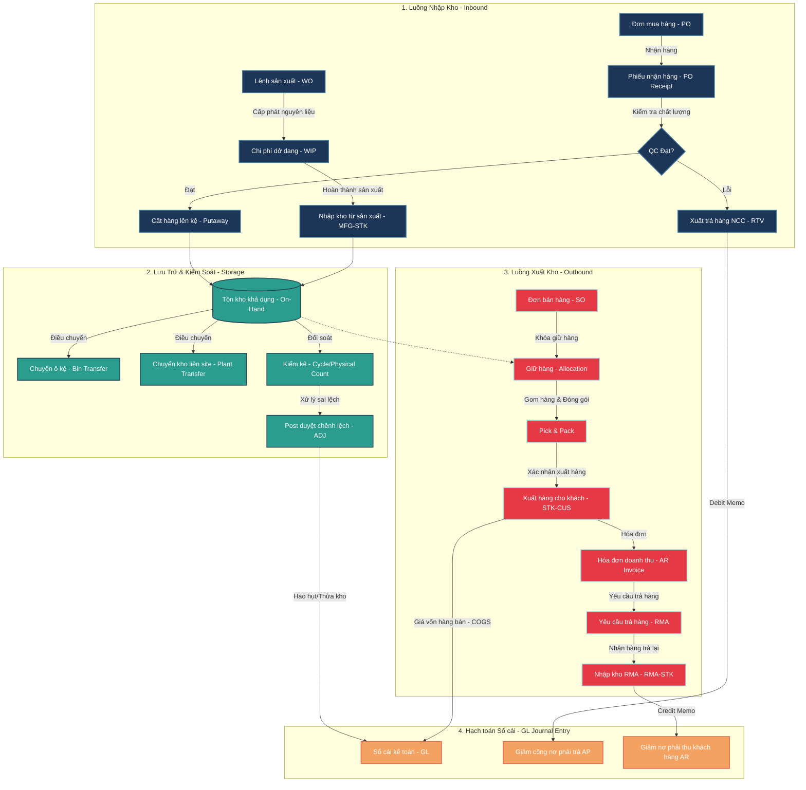

# Tổng quan Quản lý Tồn kho (INV)

Trang này tổng hợp lộ trình các bài viết về nghiệp vụ **Tồn kho (Inventory)** trong hệ thống ERP, chia theo từng nhóm chủ đề. Các mục đã có link là bài viết đã hoàn thành, các mục còn lại sẽ được cập nhật dần.

## Sơ đồ Luồng Vận hành & Dữ liệu Tồn kho tổng thể

Sơ đồ dưới đây thể hiện luồng vận hành vật lý và luồng dữ liệu (Data Flow) của phân hệ Quản lý Tồn kho (INV), kết nối chéo với các phân hệ PO, SO, MFG và tài chính kế toán (GL).

### Giải thích chi tiết các luồng vận hành trong sơ đồ

Sơ đồ trên mô tả **3 luồng Logistics vật lý** và **1 luồng hạch toán tài chính** bổ trợ chéo cho nhau:

#### 1. Luồng Nhập kho (Inbound Stream)

- **Nhập mua hàng (PO):** Hàng đi từ đơn PO → Nhập kho tạm `PO Receipt`. Toàn bộ hàng hóa bắt buộc phải đi qua chốt chặn **QC Inspection** để phân loại đạt/lỗi trước khi cho phép cất lên kệ (`Putaway`) để sử dụng. Phần hàng lỗi được chuyển sang luồng trả lại nhà cung cấp (`RTV`) để tự động ghi giảm công nợ tài chính (`Debit Memo`).
- **Nhập sản xuất (WO):** Nguyên vật liệu xuất đi sản xuất được tích lũy vào tài khoản dở dang `WIP`. Khi sản xuất hoàn thành, hàng được rút ra khỏi `WIP` và chuyển giao cho thủ kho làm giao dịch nhập kho thành phẩm (`MFG-STK`).

#### 2. Luồng Lưu trữ & Kiểm soát (Storage Stream)

- Hàng hóa sau khi nạp vào **Tồn kho khả dụng (On-hand Stock)** sẽ được định vị chính xác theo vị trí ô kệ.
- Các hoạt động điều chuyển nội bộ như chuyển ô kệ (`Bin Transfer`) hay chuyển kho liên site (`Plant Transfer`) chỉ dịch chuyển vị trí lưu trữ gốc.
- Định kỳ, hoạt động kiểm kê (`Cycle/Physical Count`) sẽ quét qua On-hand Stock để rà soát sai lệch thực tế và tự động post giao dịch điều chỉnh (`ADJ`) ghi nhận tăng/giảm tài sản gửi sang Sổ cái (`GL`).

#### 3. Luồng Xuất kho (Outbound Stream)

- **Bán hàng thông thường:** Khi có đơn SO, hệ thống tự động khóa giữ hàng (`Allocation`) để chặn các đơn hàng khác tranh chấp. Thủ kho thực hiện gom đóng gói (`Pick & Pack`) và xuất hàng (`STK-CUS`). Bút toán tự động sẽ ghi giảm tài sản và ghi nhận Giá vốn (`COGS`) đồng thời đẩy sang Sổ cái (`GL`).
- **Khách trả hàng (RMA):** Khách hàng yêu cầu trả hàng lỗi → Tạo đơn RMA → Nhập kho RMA và tự động xuất hóa đơn giảm trừ công nợ khách hàng (`Credit Memo`).

## 1. Nghiệp vụ nhập kho (Inbound)

- [x] [1000 Nhập kho từ mua hàng (Receipt from PO)](./1000-nhap-kho-tu-mua-hang-po.md)
- [x] [1010 Nhập kho từ sản xuất (Receipt from Work Order)](./1010-nhap-kho-tu-san-xuat-wo.md)
- [x] [1020 Nhập kho trả hàng từ khách (Sales Return)](./1020-nhap-kho-tra-hang-khach-rma.md)

## 2. Nghiệp vụ xuất kho (Outbound)

- [x] [2000 Xuất kho bán hàng (Issue for Sales Order)](./2000-xuat-kho-ban-hang-shipment.md)
- [x] [2010 Xuất kho cho sản xuất (Issue for Work Order/BOM)](./2010-xuat-kho-cho-san-xuat-bom.md)
- [x] [2030 Xuất kho trả nhà cung cấp (Return to Vendor - RTV)](./2020-xuat-kho-tra-nha-cung-cap-rtv.md)

## 3. Điều chuyển & tổ chức kho

- [x] [3000 Chuyển kho nội bộ (Inter-warehouse Transfer)](./3000-chuyen-kho-noi-bo-transfer.md)
- [x] [3010 Chuyển vị trí trong kho (Bin/Location Transfer)](./3010-chuyen-vi-tri-trong-kho-bin-transfer.md)
- [x] [3030 Quản lý nhiều kho, nhiều địa điểm (Multi-warehouse)](./3020-quan-ly-nhieu-kho-nhieu-dia-diem-multi-warehouse.md)
- [x] [3040 Cấu trúc Zone - Aisle - Rack - Bin (WMS)](./3030-cau-truc-zone-aisle-rack-bin-wms.md)

## 4. Kiểm kê & đối soát

- [x] [4000 Nghiệp vụ Điều chỉnh Tồn kho (Inventory Adjustment - Tăng/Giảm)](./4000-dieu-chinh-ton-kho-adjustment.md)
- [x] [4010 Kiểm kê định kỳ (Cycle Count)](./4010-kiem-ke-dinh-ky-cycle-count.md)
- [x] [4020 Kiểm kê toàn bộ (Physical Inventory)](./4020-kiem-ke-toan-bo-physical-inventory.md)
- [x] [4030 Xử lý chênh lệch kiểm kê (Count Variance)](./4030-xu-ly-chenh-lech-kiem-ke-count-variance.md)

## 5. Phương pháp tính giá & định giá tồn kho

- [x] [5000 FIFO / LIFO / Weighted Average / Standard Cost](./5000-phuong-phap-tinh-gia-fifo-lifo-average-standard.md)
- [x] [5010 Ảnh hưởng phương pháp tính giá đến giá vốn hàng bán (COGS)](./5010-anh-huong-phuong-phap-tinh-gia-den-cogs.md)
- [x] [5020 Định giá tồn kho cuối kỳ (Inventory Valuation)](./5020-dinh-gia-ton-kho-cuoi-ky-inventory-valuation.md)

## 6. Quản lý theo Lot/Serial

- [x] [6000 Quản lý theo lô (Lot Control)](./6000-quan-ly-theo-lo-lot-control.md)
- [x] [6010 Quản lý theo số serial (Serial Control)](./6010-quan-ly-theo-so-serial-serial-control.md)
- [x] [6020 FEFO (First Expired First Out)](./6020-chien-luoc-xuat-kho-fefo-first-expired-first-out.md)

## 7. Danh mục & thiết lập cơ bản

- [x] [7000 Item Master (thiết lập mã hàng hoá, đơn vị tính)](./7000-thiet-lap-danh-muc-item-master.md)
- [x] [7010 Đơn vị tính và quy đổi (UOM Conversion)](./7010-don-vi-tinh-va-quy-doi-uom-conversion.md)
- [x] [7020 Nhóm hàng hoá / danh mục vật tư (Item Category)](./7020-nhom-hang-hoa-danh-muc-vat-tu-item-category.md)
- [x] [7030 Thiết lập điểm đặt hàng lại (Reorder Point / Min-Max)](./7030-thiet-lap-diem-dat-hang-lai-reorder-point-min-max.md)

## 8. Báo cáo & phân tích

- [x] [8000 Báo cáo tồn kho theo thời điểm (Stock on Hand)](./8000-bao-cao-ton-kho-theo-thoi-diem-stock-on-hand.md)
- [x] [8010 Báo cáo nhập-xuất-tồn (Inventory Movement/Ledger)](./8010-bao-cao-nhap-xuat-ton-inventory-movement-ledger.md)
- [x] [8020 Báo cáo tồn kho chậm luân chuyển (Slow-moving/Dead Stock)](./8020-bao-cao-ton-kho-cham-luan-chuyen-slow-moving-dead-stock.md)
- [x] [8030 Dự báo nhu cầu tồn kho (Inventory Forecasting)](./8030-du-bao-nhu-cau-ton-kho-inventory-forecasting.md)

## 9. Tích hợp & lỗi thường gặp

- [x] [9000 Đồng bộ tồn kho giữa các module (INV ↔ PO ↔ SO ↔ MFG)](./9000-dong-bo-ton-kho-giua-cac-module-inv-po-so-mfg.md)
- [x] [9010 Lỗi quy đổi đơn vị tính (UOM) — Pattern lỗi phổ biến khiến báo cáo ERP sai lệch](./9010-loi-quy-doi-uom-thuong-gap.md)
- [x] [9020 Xử lý âm kho (Negative Inventory)](./9020-xu-ly-am-kho-negative-inventory.md)
- [x] [9030 Xử lý tồn kho khi đổi kỳ kế toán (Period Close)](./9030-xu-ly-ton-kho-khi-doi-ky-ke-toan-period-close.md)